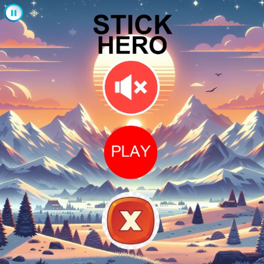

# STICK-HERO

22603(Shashank Mishra)     
22573(Vinay Kumar Dubey)   

## Introduction

------------

Stick Hero is a simple JavaFX game that challenges players to control a hero to cross platforms by building and extending a stick. The goal is to reach as far as possible while avoiding obstacles and collecting points.

Classes
-------

### Scene1

The Scene1 class represents the welcome screen of the game. It contains methods to display the welcome screen, exit screen, and the "PLAY" button. It also handles button events for exiting the game and toggling the volume.

### Methods:

*   welcomeScreen(Stage stage): Displays the welcome screen with the game title, "PLAY" button, and volume toggle button.
*   ExitScreen(Stage stage): Displays the exit screen with the current and high scores.
*   createPlayButton(Group root, Scene scene, Stage stage): Creates the "PLAY" button with animations and event handlers.

### Stick

The Stick class is the main class responsible for running the Stick Hero game. It manages the game scenes, hero movement, stick building, and interaction with obstacles.
Methods:

start(Stage stage): Initializes and displays the welcome screen.
*   showScene2(Stage stage): Switches to the main game scene where the hero moves across platforms.
*   generateRandomPillar(Group root, double sceneWidth, double heroSize): Generates random platforms (pillars) for the hero to jump on.
*   setHeroPosition(ImageView heroim, PillarInfo pillarInfo): Sets the initial position of the hero on the generated pillar.
*   applyHoverAnimation(Button button): Applies a hover animation to buttons for a better user experience.
*   buildStick(Rectangle stick): Increases the height of the stick during the building phase.
*   rotateStick(Rectangle stick): Rotates the stick to bridge the gap between platforms.
*   checkCollisionWithCircles(ImageView hero, Group root, ArrayList<Circle> circles): Checks for collisions between the hero and red circles, updating the score.
*   moveStickHero(Rectangle stick, ImageView hero, Group root): Animates the hero's movement along the stick.
*   flipHero(ImageView hero): Flips the hero vertically.
*   handleMousePressed(MouseEvent event): Handles mouse press events during stick building and hero flipping.
*   handleMouseReleased(MouseEvent event): Handles mouse release events to initiate stick rotation and hero movement.

### PillarInfo

A simple class to hold information about the generated pillar, including its start and end coordinates.

Usage
-----

1.  Run the Stick class to start the game.
2.  The welcome screen will be displayed with the "PLAY" button.
3.  Click the "PLAY" button to start the game.
4.  Build the stick by clicking and holding the left mouse button.
5.  Release the mouse button to rotate the stick and move the hero.
6.  Flip the hero by clicking the right mouse button.
7.  Collect red circles to increase your score.
8.  Reach as far as possible without falling to achieve a high score.
